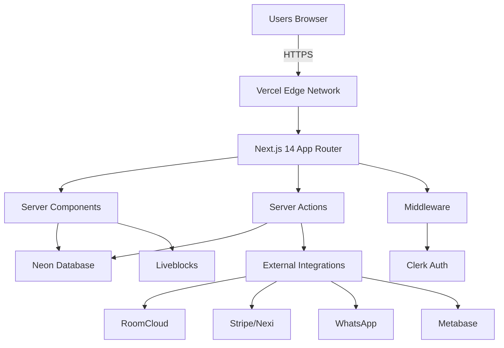

## System Architecture

Nexora is built on a modern, cloud-native architecture leveraging the Next-Forge framework.



## Core Technologies

### Frontend

<CardGroup cols={2}>
  <Card title="Next.js 14" icon="react">
    React framework with App Router and Server Components for optimal performance
  </Card>
  <Card title="shadcn/ui" icon="palette">
    Beautiful, accessible UI components built on Radix UI and Tailwind CSS
  </Card>
  <Card title="Liveblocks" icon="users">
    Real-time collaboration with presence and multiplayer editing
  </Card>
  <Card title="Languine" icon="language">
    Internationalization for English, Italian, and Portuguese
  </Card>
</CardGroup>

### Backend

<CardGroup cols={2}>
  <Card title="Neon DB" icon="database">
    Serverless PostgreSQL with auto-scaling and branching
  </Card>
  <Card title="Prisma" icon="code">
    Type-safe ORM with migrations and schema management
  </Card>
  <Card title="Clerk" icon="shield">
    Authentication with OAuth, MFA, and session management
  </Card>
  <Card title="Zod" icon="check-circle">
    Runtime validation for type-safe data handling
  </Card>
</CardGroup>

## Monorepo Structure

Nexora uses a Turborepo monorepo for code organization:

```
nexora/
├── apps/
│   ├── app/          # Main SaaS application
│   ├── web/          # Marketing website
│   ├── docs/         # Documentation (Mintlify)
│   └── api/          # Standalone API (optional)
└── packages/
    ├── database/     # Prisma schema & migrations
    ├── auth/         # Clerk integration
    ├── design-system/# UI components
    ├── analytics/    # Metabase integration
    ├── payments/     # Payment gateways
    └── ...           # Other shared packages
```

### Benefits of Monorepo

- ✅ **Code Sharing**: Share types, utilities, and components
- ✅ **Atomic Changes**: Update multiple packages in one commit
- ✅ **Type Safety**: End-to-end TypeScript with shared types
- ✅ **Faster Builds**: Turborepo caches and parallelizes builds
- ✅ **Better DX**: Single `pnpm install` for everything

## Server-First Architecture

Nexora leverages Next.js Server Components and Server Actions for optimal performance:

### Server Components (Default)

```tsx
// app/properties/page.tsx
export default async function PropertiesPage() {
  const properties = await getProperties();
  return <PropertiesList properties={properties} />;
}
```

**Benefits:**
- Zero JavaScript sent to client
- Direct database access
- Automatic caching
- Better SEO

### Client Components (When Needed)

```tsx
'use client'
export function PropertyForm() {
  const [state, setState] = useState();
  // Interactive UI with hooks
}
```

**Use for:**
- Interactive forms
- Real-time updates
- Browser APIs
- Event handlers

### Server Actions (Mutations)

```tsx
'use server'
export async function createProperty(data: FormData) {
  const validated = validatePropertyData(data);
  const property = await db.property.create({ data: validated });
  revalidatePath('/properties');
  return property;
}
```

**Benefits:**
- No API routes needed
- Progressive enhancement
- Type-safe
- Automatic revalidation

## Multi-Tenancy

Every query is scoped to an organization:

```typescript
const properties = await prisma.property.findMany({
  where: {
    organizationId: user.organizationId, // Required!
    deletedAt: null, // Soft deletes
  }
});
```

<Warning>
Queries without `organizationId` filtering will be rejected by Prisma middleware to prevent data leakage.
</Warning>

## Data Flow

<Steps>
  <Step title="User Makes Request">
    User clicks button or submits form in the browser
  </Step>
  <Step title="Middleware Checks Auth">
    Next.js middleware validates session via Clerk
  </Step>
  <Step title="Server Action Executes">
    Server Action validates input, checks permissions
  </Step>
  <Step title="Database Query">
    Prisma query with organization filter
  </Step>
  <Step title="Response & Revalidation">
    Data returned, caches revalidated, UI updates
  </Step>
</Steps>

## Key Architectural Decisions

### ADR-001: Next.js over Custom Backend
**Decision**: Use Next.js App Router instead of separate backend  
**Rationale**: Simplified deployment, better DX, Server Components  
**Trade-offs**: Coupled to Next.js, vendor lock-in to Vercel

### ADR-002: Neon over Self-Hosted PostgreSQL
**Decision**: Use Neon serverless PostgreSQL  
**Rationale**: Auto-scaling, branching, no ops overhead  
**Trade-offs**: Vendor lock-in, higher cost at scale

### ADR-003: Clerk over NextAuth
**Decision**: Use Clerk for authentication  
**Rationale**: Better UX, hosted UI, MFA built-in  
**Trade-offs**: Cost per user, vendor lock-in

### ADR-004: Metabase over Custom Analytics
**Decision**: Embed Metabase for analytics  
**Rationale**: Self-service BI, no development needed, professional visualizations  
**Trade-offs**: Additional infrastructure, Docker hosting

## Performance

### Caching Strategy

- **Static Pages**: ISR with 60s revalidation
- **Dynamic Pages**: Server Components (auto-cached)
- **API Routes**: 30s cache for reads
- **Database**: Prisma query caching

### Optimization

- **Images**: Next.js Image with automatic WebP
- **Code Splitting**: Automatic by Next.js
- **Database**: Indexes on all foreign keys
- **CDN**: Vercel Edge Network globally

## Security

<AccordionGroup>
  <Accordion title="Authentication" icon="lock">
    - Clerk handles all auth
    - JWT tokens in httpOnly cookies
    - Session expiration after 24 hours
    - MFA support
  </Accordion>
  
  <Accordion title="Authorization" icon="user-shield">
    - Role-based access control (6 roles)
    - Property-level permissions
    - Organization-level isolation
    - Audit logging for all mutations
  </Accordion>
  
  <Accordion title="Data Protection" icon="shield-check">
    - SQL injection prevented by Prisma
    - XSS prevention via React
    - CSRF protection via Clerk
    - Rate limiting on API routes
  </Accordion>
  
  <Accordion title="Compliance" icon="scale-balanced">
    - GDPR compliant (EU)
    - LGPD compliant (Brazil)
    - PCI DSS (via payment gateways)
    - Italian fiscal requirements
  </Accordion>
</AccordionGroup>

## Deployment

Nexora deploys to Vercel:

```bash
# Push to main branch triggers deployment
git push origin main
```

**Deployment includes:**
- ✅ Automatic builds
- ✅ Preview deployments for PRs
- ✅ Edge CDN globally
- ✅ Automatic HTTPS
- ✅ Environment variable management

## Learn More

<CardGroup cols={2}>
  <Card title="Tech Stack Details" href="/architecture/tech-stack">
    Deep dive into each technology
  </Card>
  <Card title="Database Schema" href="/architecture/database">
    Explore the data model
  </Card>
  <Card title="Multi-Tenancy" href="/architecture/multi-tenancy">
    How data isolation works
  </Card>
  <Card title="Security" href="/architecture/security">
    Security best practices
  </Card>
</CardGroup>

