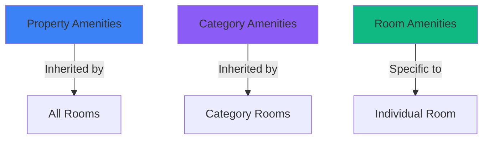

## Overview

The amenity system in Nexora works on three levels: property-wide, room category, and individual room. This hierarchy allows for efficient management while providing flexibility for unique offerings.

## Amenity Levels

<Tabs>
  <Tab title="Property Level">
    **Property Amenities** apply to all rooms by default
    
    Examples:
    - WiFi throughout property
    - Free parking
    - Swimming pool
    - Gym/fitness center
    - Restaurant
  </Tab>
  
  <Tab title="Category Level">
    **Category Amenities** apply to all rooms in that category
    
    Examples:
    - Air conditioning (only in premium categories)
    - Balcony (suite categories)
    - Kitchen (apartment categories)
    - Bathtub (deluxe categories)
  </Tab>
  
  <Tab title="Room Level">
    **Room Amenities** are specific to individual rooms
    
    Examples:
    - Sea view (specific rooms)
    - Corner unit
    - Recently renovated
    - Extra large
  </Tab>
</Tabs>

## Amenity Hierarchy



**Final Amenities** = Property + Category + Room (combined, duplicates removed)

## Amenity Categories

Amenities are organized into categories for easy management:

<CardGroup cols={2}>
  <Card title="Room Features" icon="wifi">
    WiFi, AC, Heating, Desk, Wardrobe, Safe
  </Card>
  <Card title="Bathroom" icon="bath">
    Private Bathroom, Shower, Bathtub, Hairdryer, Toiletries
  </Card>
  <Card title="Entertainment" icon="tv">
    TV, Streaming Services, Sound System, Games
  </Card>
  <Card title="Kitchen" icon="coffee">
    Mini Fridge, Coffee Maker, Kettle, Microwave
  </Card>
  <Card title="Safety" icon="shield">
    Smoke Detector, Fire Extinguisher, First Aid Kit
  </Card>
  <Card title="Accessibility" icon="accessible">
    Wheelchair Accessible, Grab Bars, Elevator Access
  </Card>
  <Card title="Outdoor" icon="tree">
    Balcony, Terrace, Garden, Sea View, Mountain View
  </Card>
  <Card title="Services" icon="concierge-bell">
    Room Service, Laundry, Concierge, Turndown Service
  </Card>
</CardGroup>

## Using the Amenity Selector

The amenity selector provides a searchable, multi-select interface:

<Steps>
  <Step title="Click Select Amenities">
    Open the amenity selector dropdown
  </Step>
  
  <Step title="Browse by Category">
    Amenities are grouped by category (Room Features, Bathroom, etc.)
  </Step>
  
  <Step title="Search">
    Type to filter amenities by name
  </Step>
  
  <Step title="Select Multiple">
    Click to select/deselect amenities
  </Step>
  
  <Step title="Review Selection">
    Selected amenities appear as badges below the dropdown
  </Step>
  
  <Step title="Remove">
    Click the × on any badge to remove that amenity
  </Step>
</Steps>

## Custom Amenities

Create property-specific amenities not in the standard library:

```typescript
import { createAmenity } from '@/app/actions/amenities';

await createAmenity({
  name: "Rooftop Jacuzzi",
  i18nKey: "amenity.custom.rooftop_jacuzzi",
  category: "CUSTOM",
  icon: "waves",
  description: "Private rooftop jacuzzi with city views"
});
```

<Info>
Custom amenities are added to your library and can be reused across all properties in your organization.
</Info>

## Best Practices

<AccordionGroup>
  <Accordion title="Assign at the Right Level" icon="layer-group">
    - **Property Level**: Amenities ALL rooms have (WiFi, parking)
    - **Category Level**: Amenities specific to room type (balcony for suites)
    - **Room Level**: Unique features (corner unit, renovated)
  </Accordion>
  
  <Accordion title="Keep It Accurate" icon="check-circle">
    Only list amenities that are actually available. Incorrect amenity listings lead to guest complaints.
  </Accordion>
  
  <Accordion title="Use Standard Names" icon="tag">
    Stick to the predefined amenities when possible for consistency and translation support.
  </Accordion>
  
  <Accordion title="Add Icons" icon="image">
    Icons help guests quickly identify amenities at a glance.
  </Accordion>
</AccordionGroup>

## Amenity Display

### To Guests

Amenities are displayed during booking:

```tsx
// Combined amenities shown to guests
const displayedAmenities = [
  { name: "WiFi", source: "property" },
  { name: "Air Conditioning", source: "category" },
  { name: "Sea View", source: "room" }
];
```

### Source Indicators

When viewing internally, amenities show their source:

- **Property** (light badge) - Inherited from property
- **Category** (secondary badge) - Inherited from category
- **Room** (primary badge) - Specific to this room

## Server Actions

### Get All Amenities

```typescript
import { getAmenities } from '@/app/actions/amenities';

const result = await getAmenities();

if (result.success) {
  const amenities = result.data;
  // Amenities grouped by category
}
```

### Get Room's Combined Amenities

```typescript
import { getRoomAmenities } from '@/app/actions/amenities';

const result = await getRoomAmenities(roomId);

if (result.success) {
  // Returns combined amenities from property + category + room
  // Each amenity includes its source for transparency
  const amenities = result.data;
}
```

### Assign Amenities to Room

```typescript
import { assignAmenitiesToRoom } from '@/app/actions/amenities';

await assignAmenitiesToRoom(
  roomId,
  [amenityId1, amenityId2, amenityId3]
);
```

## Multilingual Support

Amenities support multiple languages via the i18n system:

```json
{
  "en": {
    "amenity.wifi": "WiFi",
    "amenity.ac": "Air Conditioning",
    "amenity.balcony": "Balcony"
  },
  "it": {
    "amenity.wifi": "WiFi",
    "amenity.ac": "Aria Condizionata",
    "amenity.balcony": "Balcone"
  },
  "pt": {
    "amenity.wifi": "WiFi",
    "amenity.ac": "Ar Condicionado",
    "amenity.balcony": "Varanda"
  }
}
```

## Validation Rules

<Check>**Name**: Minimum 2 characters</Check>
<Check>**i18nKey**: Must be unique across all amenities</Check>
<Check>**Category**: Must be valid enum value</Check>
<Check>**Cannot Delete**: If amenity is in use anywhere</Check>

## Example: Complete Setup

<Steps>
  <Step title="Property Level">
    Add amenities available throughout the property:
    - WiFi
    - Free Parking
    - 24-hour Reception
    - Breakfast Included
  </Step>
  
  <Step title="Standard Double Category">
    Add category-specific amenities:
    - Air Conditioning
    - Private Bathroom
    - TV
    - Mini Fridge
  </Step>
  
  <Step title="Deluxe Suite Category">
    Add premium amenities:
    - All Standard Double amenities (inherited)
    - Balcony
    - Bathtub
    - Coffee Machine
    - Sea View
  </Step>
  
  <Step title="Room 201 (Special)">
    Add room-specific features:
    - All Deluxe Suite amenities (inherited)
    - Recently Renovated
    - Corner Unit
    - Extra Large
  </Step>
</Steps>

**Result**: Room 201 displays all amenities from all three levels.

## API Reference

<CardGroup cols={2}>
  <Card title="Get Amenities" href="/api-reference/amenities/list">
    List all available amenities
  </Card>
  <Card title="Create Amenity" href="/api-reference/amenities/create">
    Create custom amenities
  </Card>
  <Card title="Assign to Category" href="/api-reference/room-categories/amenities">
    Manage category amenities
  </Card>
  <Card title="Assign to Room" href="/api-reference/rooms/amenities">
    Manage room amenities
  </Card>
</CardGroup>

