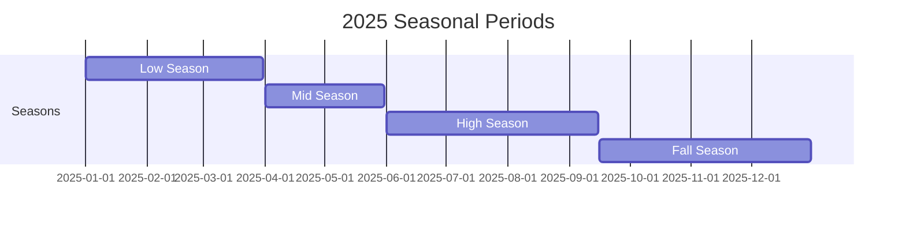

## Overview

The availability system provides real-time tracking of room status, manual blocking capabilities, and visual calendar views for efficient property management.

## Availability States

Rooms can be in various availability states:

<CardGroup cols={3}>
  <Card title="Available" icon="check">
    Room is ready and can be booked
  </Card>
  <Card title="Occupied" icon="user">
    Room is currently booked
  </Card>
  <Card title="Blocked" icon="ban">
    Manually blocked from bookings
  </Card>
  <Card title="Maintenance" icon="wrench">
    Under maintenance or repair
  </Card>
  <Card title="Cleaning" icon="sparkles">
    Being cleaned between guests
  </Card>
</CardGroup>

## Manual Blocks

Block rooms from booking for specific periods:

<Steps>
  <Step title="Select Room">
    Choose the room to block on the calendar
  </Step>
  
  <Step title="Set Date Range">
    Select start and end dates for the block
  </Step>
  
  <Step title="Add Reason">
    Specify why the room is blocked:
    - Maintenance
    - Renovation
    - Owner use
    - Seasonal closure
    - Other
  </Step>
  
  <Step title="Add Note (Optional)">
    Internal note about the block for staff reference
  </Step>
  
  <Step title="Save">
    Block is applied immediately and syncs across all users
  </Step>
</Steps>

### Example

```typescript
import { createAvailabilityBlock } from '@/app/actions/availability';

await createAvailabilityBlock({
  roomId: "room_201",
  startDate: new Date("2025-12-20"),
  endDate: new Date("2025-12-27"),
  reason: "Annual Maintenance",
  note: "Deep cleaning and bathroom renovation"
});
```

## Calendar Views

View availability in different timeframes:

<Tabs>
  <Tab title="Month View">
    **Best for**: Overview and planning
    
    Shows:
    - All rooms on Y-axis
    - 30-31 days on X-axis
    - Color-coded availability status
    - Seasonal period overlays
  </Tab>
  
  <Tab title="Week View">
    **Best for**: Weekly operations
    
    Shows:
    - 7-day view
    - More detail per day
    - Check-in/check-out times
    - Easier to see patterns
  </Tab>
  
  <Tab title="Day View">
    **Best for**: Daily operations
    
    Shows:
    - Single day in detail
    - Hourly breakdown
    - Room status
    - Housekeeping progress
  </Tab>
</Tabs>

## Color Coding

Calendar uses colors for quick visual reference:

| Color | Meaning |
|-------|---------|
| 🟢 Green | Available for booking |
| 🔴 Red | Occupied / Booked |
| 🟡 Yellow | Cleaning in progress |
| ⚫ Gray | Maintenance mode |
| 🟠 Orange | Manually blocked |
| 🔵 Blue | Season overlay |

<Tip>
Hover over any calendar cell to see details: guest name (if permitted), booking reference, or block reason.
</Tip>

## Season Overlays

Seasonal periods appear as background colors on the calendar:



This helps visualize pricing periods and booking patterns.

## Finding Available Rooms

Query availability for specific dates:

```typescript
import { getAvailableRooms } from '@/app/actions/availability';

const result = await getAvailableRooms(
  propertyId,
  new Date("2025-08-01"),  // Check-in
  new Date("2025-08-05")   // Check-out
);

if (result.success) {
  const availableRooms = result.data;
  // Filter by category, capacity, amenities, etc.
}
```

<Info>
Available rooms are those that are:
- ✅ Bookable (not set to bookable=false)
- ✅ Not occupied
- ✅ Not in maintenance
- ✅ Not manually blocked
- ✅ Meet capacity requirements
</Info>

## Occupancy Statistics

Track property performance:

```typescript
import { getOccupancyStats } from '@/app/actions/availability';

const result = await getOccupancyStats(
  propertyId,
  startDate,
  endDate
);

if (result.success) {
  const stats = result.data;
  // stats.totalRooms
  // stats.availableRooms
  // stats.blockedRooms
  // stats.occupancyPercentage
}
```

<CardGroup cols={2}>
  <Card title="Total Rooms">
    All bookable rooms in the property
  </Card>
  <Card title="Available Rooms">
    Rooms ready for booking
  </Card>
  <Card title="Blocked Rooms">
    Rooms in maintenance or manually blocked
  </Card>
  <Card title="Occupancy %">
    Percentage of rooms occupied
  </Card>
</CardGroup>

## Real-time Updates

<Note>
Availability calendar updates in real-time across all users via Liveblocks. When one user makes a booking or blocks a room, all other users see the update immediately.
</Note>

Features:
- ✅ Instant updates (< 100ms)
- ✅ Presence indicators (see who's viewing)
- ✅ Conflict prevention
- ✅ Optimistic UI updates

## Exporting Availability

Export availability data for external systems:

```typescript
// Export to CSV for analysis
const availability = await getAvailability(
  propertyId,
  startDate,
  endDate
);

// Format: Date, Room, Category, Status, Booking Ref
```

## Best Practices

<AccordionGroup>
  <Accordion title="Block Maintenance in Advance" icon="calendar-check">
    Schedule maintenance during low-occupancy periods and block rooms well in advance
  </Accordion>
  
  <Accordion title="Use Clear Reasons" icon="message-square">
    Always specify why a room is blocked for team clarity
  </Accordion>
  
  <Accordion title="Monitor Occupancy" icon="chart-line">
    Review occupancy statistics weekly to optimize pricing
  </Accordion>
  
  <Accordion title="Remove Old Blocks" icon="trash">
    Clean up expired availability blocks to keep data organized
  </Accordion>
  
  <Accordion title="Seasonal Planning" icon="calendar">
    Use seasonal periods to visualize high/low demand periods
  </Accordion>
</AccordionGroup>

## Integration with Bookings

When a booking is created (Phase 2):

<Steps>
  <Step title="Check Availability">
    System checks if room is available for requested dates
  </Step>
  
  <Step title="Prevent Conflicts">
    Blocks overlapping bookings automatically
  </Step>
  <Step title="Update Calendar">
    Room shows as occupied for the booking period
  </Step>
  
  <Step title="Real-time Sync">
    All users see the updated availability immediately
  </Step>
</Steps>

## Channel Manager Sync

Availability syncs with OTAs (Phase 3):

```
Nexora → RoomCloud → Airbnb, Booking.com, etc.

- Real-time availability updates
- Prevent overbookings
- Two-way synchronization
```

## Next Steps

<CardGroup cols={2}>
  <Card title="Room Management" icon="bed" href="/features/rooms">
    Create and configure rooms
  </Card>
  <Card title="Bookings" icon="calendar-check" href="/features/bookings">
    Start taking reservations (Phase 2)
  </Card>
  <Card title="Channel Manager" icon="link" href="/features/channel-manager">
    Sync with OTAs (Phase 3)
  </Card>
  <Card title="API Reference" icon="code" href="/api-reference/availability">
    Explore availability APIs
  </Card>
</CardGroup>

