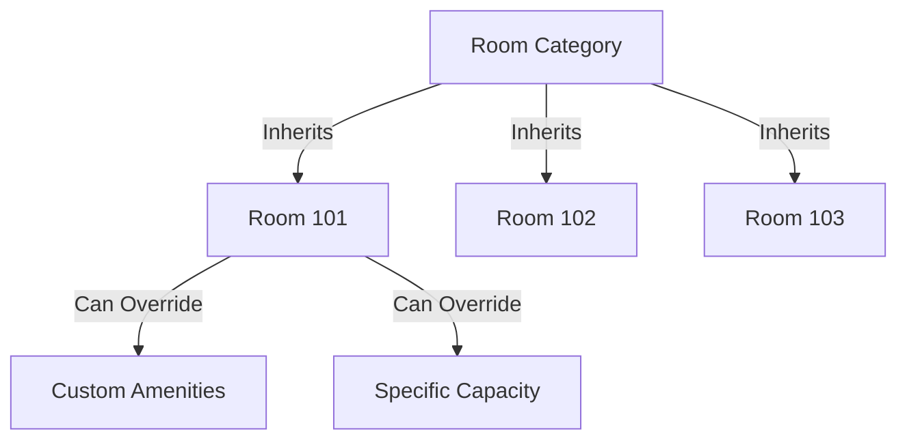

## Overview

Room Categories (also called Room Types) define the different types of accommodations available in your property. Each category can have multiple individual rooms assigned to it.

<Info>
Room categories enable efficient management by grouping similar rooms together. Changes to a category automatically apply to all rooms unless individually overridden.
</Info>

## Creating a Room Category

<Steps>
  <Step title="Navigate to Property">
    Go to Properties → Select your property → Room Categories tab
  </Step>
  
  <Step title="Click New Category">
    Click "+ New Category" button
  </Step>
  
  <Step title="Basic Information">
    Fill in the category details:
    
    <ParamField path="name" type="string" required>
      Full name (e.g., "Deluxe Suite", "Standard Double Room")
    </ParamField>
    
    <ParamField path="shortName" type="string">
      Abbreviated name for calendar display (e.g., "DLX STE", "STD DBL")
    </ParamField>
    
    <ParamField path="description" type="string">
      Marketing description shown to guests
    </ParamField>
  </Step>
  
  <Step title="Configure Capacity">
    Set occupancy limits:
    
    ```typescript
    {
      minCapacity: 1,      // Minimum guests
      maxCapacity: 2,      // Standard capacity
      extraCapacity: 1,    // Additional guests allowed
      extraCapacityTypes: {
        adults: 1,         // Max extra adults
        children: 0,       // Max extra children
        infants: 0         // Max extra infants
      }
    }
    ```
  </Step>
  
  <Step title="Define Bed Configurations">
    Add bed configuration options:
    
    <CardGroup cols={2}>
      <Card title="Configuration 1">
        1 King Bed
      </Card>
      <Card title="Configuration 2">
        2 Twin Beds
      </Card>
    </CardGroup>
    
    Mark one as the default configuration.
  </Step>
  
  <Step title="Set Policies">
    Configure room policies:
    - **Pets Allowed**: Yes/No (if yes, max number)
    - **Smoking Allowed**: Yes/No
  </Step>
  
  <Step title="Choose Color">
    Select a color for calendar visualization
    
    <Tip>
    Choose distinct colors for easy visual identification on the calendar
    </Tip>
  </Step>
  
  <Step title="Upload Photos">
    Add room photos, videos, and virtual tour links
  </Step>
  
  <Step title="Select Amenities">
    Choose amenities from the library or create custom ones
  </Step>
</Steps>

## Capacity Management

### Standard Capacity

The number of guests a room can comfortably accommodate:

```typescript
minCapacity: 1    // Can accommodate 1 guest minimum
maxCapacity: 2    // Standard capacity for 2 guests
```

### Extra Capacity

Additional guests beyond standard capacity:

```typescript
extraCapacity: 2  // Can add up to 2 more guests

extraCapacityTypes: {
  adults: 1,      // Max 1 additional adult
  children: 1,    // Max 1 additional child
  infants: 1      // Max 1 infant (doesn't count toward capacity)
}
```

<Warning>
Total capacity = maxCapacity + extraCapacity. Ensure your bed configurations support this total.
</Warning>

## Bed Configurations

Define multiple bed arrangement options for flexibility:

<Tabs>
  <Tab title="Example 1: Standard Double">
    ```json
    {
      "bedConfigurations": [
        {
          "id": "config1",
          "name": "1 Double Bed",
          "beds": [
            { "type": "double", "count": 1 }
          ]
        },
        {
          "id": "config2",
          "name": "2 Twin Beds",
          "beds": [
            { "type": "twin", "count": 2 }
          ]
        }
      ],
      "defaultBedConfig": {
        "id": "config1",
        "name": "1 Double Bed",
        "beds": [{ "type": "double", "count": 1 }]
      }
    }
    ```
  </Tab>
  
  <Tab title="Example 2: Family Suite">
    ```json
    {
      "bedConfigurations": [
        {
          "id": "config1",
          "name": "1 King + Sofa Bed",
          "beds": [
            { "type": "king", "count": 1 },
            { "type": "sofa", "count": 1 }
          ]
        },
        {
          "id": "config2",
          "name": "1 Queen + 2 Twin",
          "beds": [
            { "type": "queen", "count": 1 },
            { "type": "twin", "count": 2 }
          ]
        }
      ]
    }
    ```
  </Tab>
</Tabs>

## Amenities

Assign amenities to the entire category. All rooms in this category will inherit these amenities:

<AccordionGroup>
  <Accordion title="Room Features" icon="wifi">
    - WiFi
    - Air Conditioning
    - Heating
    - Desk
    - Wardrobe
  </Accordion>
  
  <Accordion title="Bathroom" icon="shower">
    - Private Bathroom
    - Shower
    - Bathtub
    - Hairdryer
    - Toiletries
  </Accordion>
  
  <Accordion title="Entertainment" icon="tv">
    - TV
    - Streaming Services
    - Sound System
  </Accordion>
  
  <Accordion title="Outdoor" icon="tree">
    - Balcony
    - Terrace
    - Garden View
    - Sea View
  </Accordion>
</AccordionGroup>

<Tip>
Individual rooms can override category amenities if needed.
</Tip>

## Color Coding

Each category is assigned a color for easy visual identification:

<CardGroup cols={3}>
  <Card title="Calendar View">
    Rooms display in their category color on the calendar
  </Card>
  <Card title="Reports">
    Charts and graphs use category colors
  </Card>
  <Card title="Room Cards">
    Room cards show a colored border matching their category
  </Card>
</CardGroup>

## Server Actions

### Get Categories

```typescript
import { getRoomCategories } from '@/app/actions/room-categories';

const result = await getRoomCategories(propertyId);

if (result.success) {
  const categories = result.data;
  // Each category includes:
  // - Basic info (name, description)
  // - Capacity settings
  // - Bed configurations
  // - Amenities
  // - Room count
}
```

### Create Category

```typescript
import { createRoomCategory } from '@/app/actions/room-categories';

const result = await createRoomCategory({
  propertyId: "prop_123",
  name: "Deluxe Suite",
  shortName: "DLX STE",
  minCapacity: 2,
  maxCapacity: 4,
  extraCapacity: 1,
  bedConfigurations: [
    {
      id: "config1",
      name: "1 King Bed",
      beds: [{ type: "king", count: 1 }]
    }
  ],
  defaultBedConfig: { /* ... */ },
  color: "#8B5CF6",
  petsAllowed: true,
  smokingAllowed: false,
});
```

### Assign Amenities

```typescript
import { assignAmenitiesToCategory } from '@/app/actions/room-categories';

await assignAmenitiesToCategory(
  categoryId,
  [amenityId1, amenityId2, amenityId3]
);
```

## Best Practices

<AccordionGroup>
  <Accordion title="Use Clear Names" icon="tag">
    Use descriptive names that guests will understand (e.g., "Ocean View Suite" instead of "Type A")
  </Accordion>
  
  <Accordion title="Set Accurate Capacity" icon="users">
    Ensure bed configurations support your capacity settings. A 4-person capacity needs enough beds!
  </Accordion>
  
  <Accordion title="Choose Distinct Colors" icon="palette">
    Use different colors for each category for easy visual identification on calendars
  </Accordion>
  
  <Accordion title="Complete Descriptions" icon="file-text">
    Write compelling descriptions - these are shown to potential guests
  </Accordion>
  
  <Accordion title="Professional Photos" icon="image">
    Upload high-quality photos. First photo becomes the primary image.
  </Accordion>
</AccordionGroup>

## Inheritance

Category settings are inherited by all rooms in that category:



Rooms can override category settings when needed for specific configurations.

## Validation Rules

<Check>**Name**: Must be unique within the property</Check>
<Check>**Capacity**: minCapacity ≤ maxCapacity</Check>
<Check>**Bed Configurations**: At least one configuration required</Check>
<Check>**Default Bed Config**: Must match one of the configurations</Check>
<Check>**Color**: Valid hex color (#RRGGBB format)</Check>
<Check>**Photos**: Valid URLs with alt text</Check>

## Next Steps

<CardGroup cols={2}>
  <Card title="Add Individual Rooms" icon="door-open" href="/features/rooms">
    Create specific rooms within this category
  </Card>
  <Card title="Configure Pricing" icon="dollar-sign" href="/features/pricing">
    Set rates for this category (Phase 4)
  </Card>
  <Card title="Manage Amenities" icon="star" href="/features/amenities">
    Add or customize amenities
  </Card>
  <Card title="API Reference" icon="code" href="/api-reference/room-categories">
    Explore room category APIs
  </Card>
</CardGroup>

