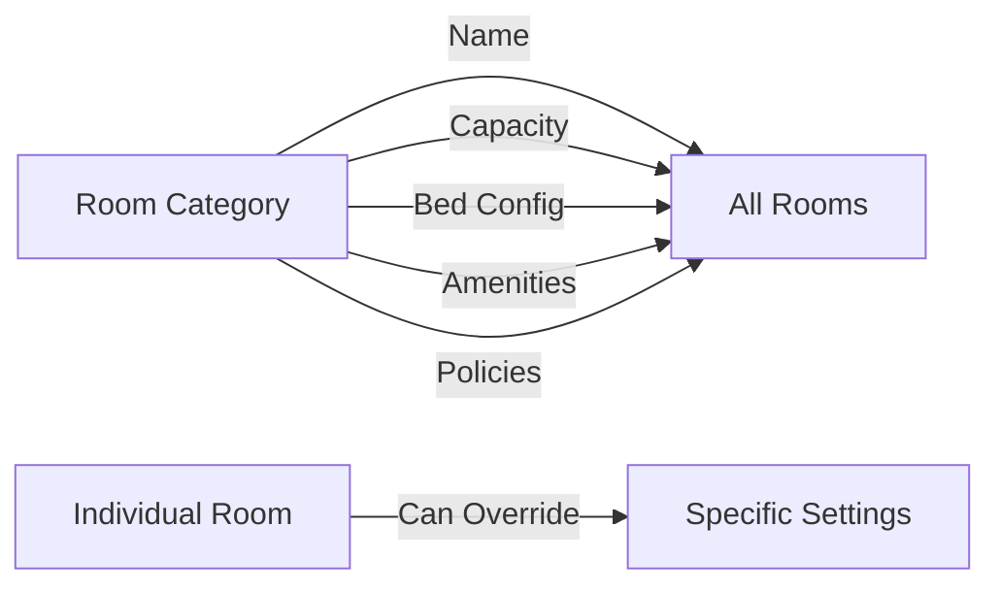

## Overview

Individual Rooms are specific units within a Room Category. While they inherit settings from their category, each room can have unique attributes like room number, floor, and specific amenities.

## Creating Rooms

<Steps>
  <Step title="Select Category">
    Navigate to your property's room categories and select the category where you want to add rooms
  </Step>
  
  <Step title="Click Add Room">
    Click the "+ Add Room" button
  </Step>
  
  <Step title="Basic Details">
    <ParamField path="number" type="string" required>
      Room number or name (e.g., "101", "Ocean Suite A")
    </ParamField>
    
    <ParamField path="floor" type="string">
      Floor number or level (e.g., "1", "Ground", "Mezzanine")
    </ParamField>
    
    <ParamField path="bookable" type="boolean" default={true}>
      Whether the room can be booked online
    </ParamField>
  </Step>
  
  <Step title="Override Settings (Optional)">
    Override category defaults if this specific room differs:
    - Custom capacity
    - Different bed configuration
    - Specific amenities
    - Special CIN code
  </Step>
</Steps>

## Room Status

Rooms can be in different operational states:

<CardGroup cols={2}>
  <Card title="Available" icon="check-circle">
    Ready for booking and occupancy
  </Card>
  <Card title="Occupied" icon="user">
    Currently occupied by guests
  </Card>
  <Card title="Cleaning" icon="sparkles">
    Being cleaned between guests
  </Card>
  <Card title="Maintenance" icon="wrench">
    Under maintenance, not bookable
  </Card>
  <Card title="Blocked" icon="ban">
    Manually blocked from bookings
  </Card>
</CardGroup>

## Maintenance Mode

Put rooms into maintenance mode with date ranges:

```typescript
{
  maintenanceMode: true,
  maintenanceFrom: "2025-12-20",
  maintenanceTo: "2025-12-27",
  maintenanceNote: "Annual deep cleaning and bathroom renovation"
}
```

<Info>
Rooms in maintenance mode are automatically blocked from bookings and show as unavailable on the calendar.
</Info>

## Category Inheritance

Rooms automatically inherit from their category:



### What's Inherited

- ✅ Capacity settings
- ✅ Bed configurations
- ✅ Amenities
- ✅ Pet and smoking policies
- ✅ Size and description

### What Can Be Overridden

Individual rooms can customize:
- 🔧 Capacity (if this specific room differs)
- 🔧 Bed configuration
- 🔧 Amenities (add or remove)
- 🔧 CIN code (if required per room)

## Room-Specific Amenities

Add amenities unique to this room:

```typescript
// Category has: WiFi, AC, TV
// This room adds: Balcony, Sea View

roomAmenities = [
  ...categoryAmenities,  // Inherited
  "Balcony",             // Room-specific
  "Sea View"             // Room-specific
]
```

<Tip>
The amenity system combines property-level, category-level, and room-level amenities automatically.
</Tip>

## Bulk Operations

Update multiple rooms at once:

```typescript
import { bulkUpdateRooms } from '@/app/actions/rooms';

await bulkUpdateRooms(
  ["room_1", "room_2", "room_3"],
  {
    floor: "2",
    bookable: true,
    status: "AVAILABLE"
  }
);
```

<Warning>
Bulk operations affect all selected rooms. Double-check your selection before applying changes.
</Warning>

## Server Actions

### Create Room

```typescript
import { createRoom } from '@/app/actions/rooms';

const result = await createRoom({
  propertyId: "prop_123",
  categoryId: "cat_456",
  number: "201",
  floor: "2",
  bookable: true,
  status: "AVAILABLE",
  order: 1
});
```

### Update Room

```typescript
import { updateRoom } from '@/app/actions/rooms';

await updateRoom("room_id", {
  floor: "3",
  bookable: false
});
```

### Set Maintenance

```typescript
import { setRoomMaintenance } from '@/app/actions/rooms';

await setRoomMaintenance(
  "room_id",
  true,  // maintenanceMode
  new Date("2025-12-20"),  // from
  new Date("2025-12-27"),  // to
  "Annual maintenance"  // note
);
```

### Delete Room

```typescript
import { deleteRoom } from '@/app/actions/rooms';

await deleteRoom("room_id");  // Soft delete
```

## Room Numbering

<AccordionGroup>
  <Accordion title="Sequential Numbering" icon="hash">
    Use floor + sequential: 101, 102, 103 (floor 1), 201, 202 (floor 2)
  </Accordion>
  
  <Accordion title="Named Rooms" icon="tag">
    For boutique properties: "Sunset Suite", "Garden Room", "Ocean Villa"
  </Accordion>
  
  <Accordion title="Mixed Format" icon="list-ordered">
    Combine numbers and names: "201 - Deluxe Ocean View"
  </Accordion>
</AccordionGroup>

<Tip>
Choose a consistent numbering scheme across your property for easy identification.
</Tip>

## Validation Rules

<Check>**Room Number**: Must be unique within the property</Check>
<Check>**Category**: Must exist and belong to the same property</Check>
<Check>**Floor**: Optional but recommended for multi-floor properties</Check>
<Check>**Status**: Must be valid enum value</Check>
<Check>**Maintenance Dates**: 'From' must be before 'To'</Check>

## Common Workflows

### Adding Multiple Rooms

When setting up a new property:

<Steps>
  <Step title="Create Categories First">
    Define all your room types (Standard, Deluxe, Suite, etc.)
  </Step>
  
  <Step title="Add Rooms in Batches">
    Add all rooms for each category sequentially
  </Step>
  
  <Step title="Use Bulk Operations">
    Set common attributes (floor, bookable status) in bulk
  </Step>
  
  <Step title="Customize As Needed">
    Override settings for rooms with unique features
  </Step>
</Steps>

### Seasonal Maintenance

<Steps>
  <Step title="Plan Maintenance">
    Schedule maintenance during low-occupancy periods
  </Step>
  
  <Step title="Block Rooms">
    Set maintenance mode with date ranges
  </Step>
  
  <Step title="Track Progress">
    Use maintenance notes to track work status
  </Step>
  
  <Step title="Reactivate">
    Turn off maintenance mode when complete
  </Step>
</Steps>

## Next Steps

<CardGroup cols={2}>
  <Card title="Availability Calendar" icon="calendar" href="/features/availability">
    View and manage room availability
  </Card>
  <Card title="Amenities" icon="star" href="/features/amenities">
    Customize room amenities
  </Card>
  <Card title="Bookings" icon="book" href="/features/bookings">
    Start taking bookings (Phase 2)
  </Card>
  <Card title="API Reference" icon="code" href="/api-reference/rooms">
    Explore room APIs
  </Card>
</CardGroup>

